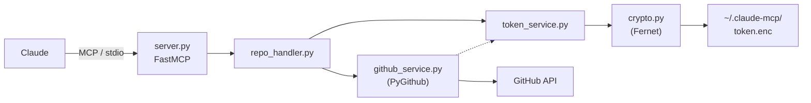

# claude-mcp-server

MCP server for managing GitHub repositories via Claude. Stores your GitHub token encrypted on disk so Claude can manage repos without ever seeing the raw token.

## Architecture



See [Architecture Documentation](docs/architecture.md) for component diagrams and data flow details.

## Tools

| Tool | Description |
|------|-------------|
| `set_github_token` | Store a GitHub PAT securely (encrypted at rest) |
| `remove_github_token` | Remove the stored token |
| `list_repositories` | List all repos for the authenticated user |
| `create_repository` | Create a new GitHub repository |
| `delete_repository` | Delete a GitHub repository |

## Setup

```bash
# Install
pip install -e .

# Generate an encryption key
python -c "from cryptography.fernet import Fernet; print(Fernet.generate_key().decode())"

# Set the key as an environment variable
export MCP_ENCRYPTION_KEY="<generated-key>"
```

## Usage

### With Claude Desktop

Add to your Claude Desktop config (`claude_desktop_config.json`):

```json
{
  "mcpServers": {
    "repo-manager": {
      "command": "python",
      "args": ["-m", "src.main"],
      "cwd": "/path/to/claude-mcp-server",
      "env": {
        "MCP_ENCRYPTION_KEY": "<your-key>"
      }
    }
  }
}
```

### Standalone

```bash
python -m src.main
```

## Token Security

- Tokens are encrypted using Fernet (AES-128-CBC) via the `cryptography` library
- The encryption key is provided via `MCP_ENCRYPTION_KEY` environment variable
- Encrypted token file is stored at `~/.claude-mcp/token.enc` with `0600` permissions
- Custom path can be set via `MCP_TOKEN_PATH` environment variable

See [Security Documentation](docs/security.md) for the full encryption model and threat model.

## Development

```bash
# Install with dev dependencies
pip install -e ".[dev]"

# Run tests
pytest tests/ -v
```

See [Contributing Guide](CONTRIBUTING.md) for commit conventions, PR process, and code style.

## CI/CD Pipeline

The project uses a three-stage GitHub Actions pipeline:

| Stage | Trigger | Result |
|-------|---------|--------|
| **CI** (`ci.yml`) | PR to `dev` or `main` | Runs pytest — gates PR mergeability |
| **Dev Release** (`release-dev.yml`) | PR merged to `dev` | Version bump from labels, Docker push `dev-X.Y.Z`, git tag |
| **Prd Release** (`release-prd.yml`) | PR merged to `main` | Docker push `X.Y.Z` + `latest` from existing tag |

See [CI/CD Pipeline](docs/cicd-pipeline.md) for detailed diagrams, end-to-end examples, and version bump rules.

## Documentation

| Document | Description |
|----------|-------------|
| [Architecture](docs/architecture.md) | Component diagrams, data flow, module responsibilities |
| [Branching Strategy](docs/branching-strategy.md) | Git workflow, branch types, lifecycle diagrams |
| [CI/CD Pipeline](docs/cicd-pipeline.md) | Pipeline stages, Docker tags, version bump rules |
| [Security](docs/security.md) | Token encryption, threat model, CI/CD security |
| [Deployment](docs/deployment.md) | Local setup, Docker, Claude Desktop integration |
| [Contributing](CONTRIBUTING.md) | Commit conventions, PR process, code style |
