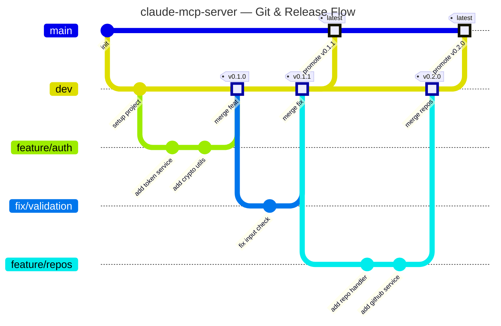
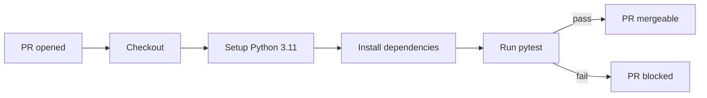
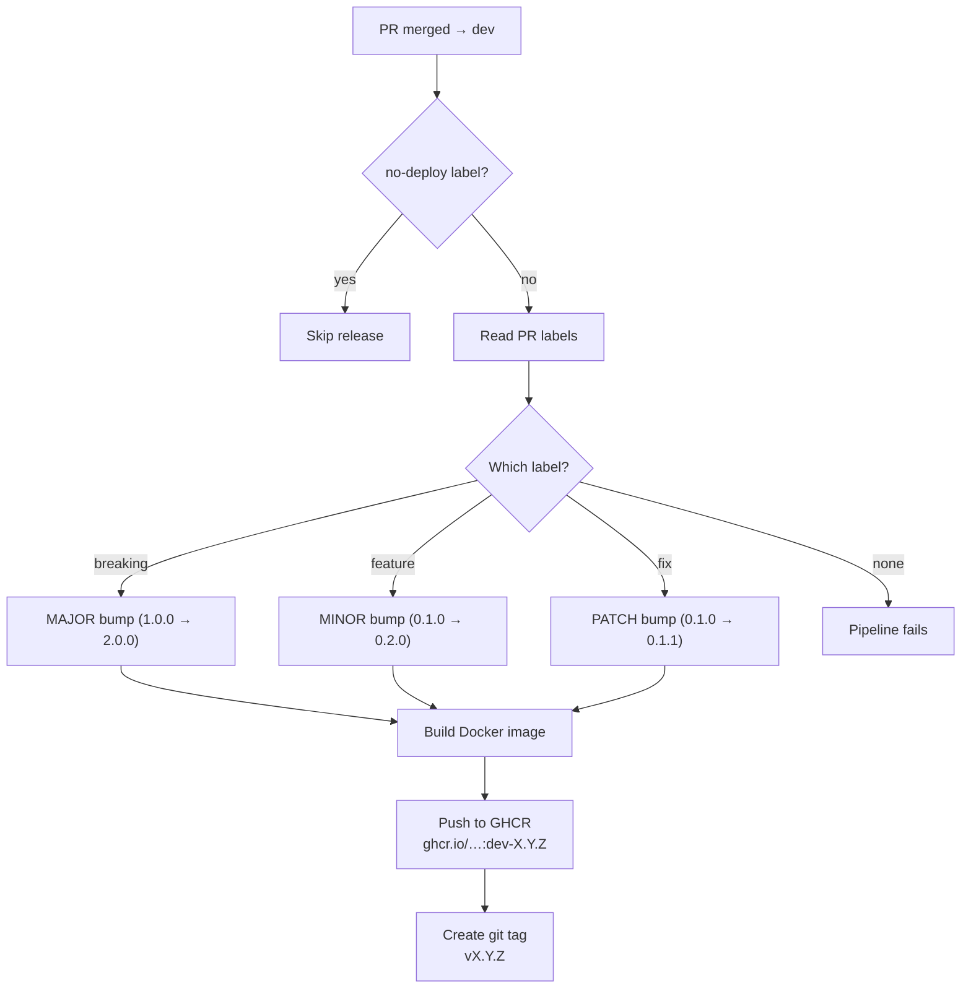
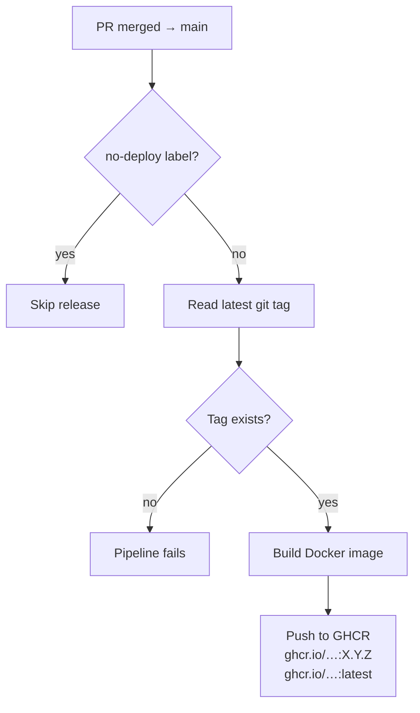
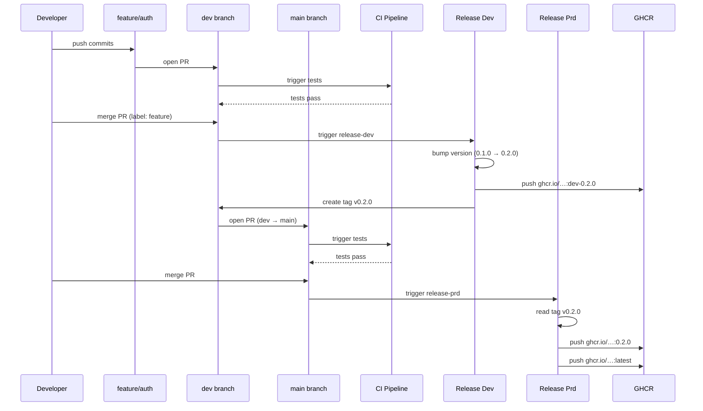

# claude-mcp-server

MCP server for managing GitHub repositories via Claude. Stores your GitHub token encrypted on disk so Claude can manage repos without ever seeing the raw token.

## Table of Contents

- [Tools](#tools)
- [Setup](#setup)
- [Usage](#usage)
  - [With Claude Desktop](#with-claude-desktop)
  - [Standalone](#standalone)
- [Token Security](#token-security)
- [Development](#development)
- [CI/CD Pipeline](#cicd-pipeline)
  - [Git Workflow](#git-workflow)
  - [Pipeline Stages](#pipeline-stages)
    - [CI — Pull Request Validation](#1-ci--pull-request-validation-ciyml)
    - [Dev Release](#2-dev-release-release-devyml)
    - [Production Release](#3-production-release-release-prdyml)
  - [End-to-End Example](#end-to-end-example)
  - [Docker Tag Summary](#docker-tag-summary)
  - [Version Bump Rules](#version-bump-rules)

## Tools

| Tool | Description |
|------|-------------|
| `set_github_token` | Store a GitHub PAT securely (encrypted at rest) |
| `remove_github_token` | Remove the stored token |
| `list_repositories` | List all repos for the authenticated user |
| `create_repository` | Create a new GitHub repository |
| `delete_repository` | Delete a GitHub repository |

## Setup

```bash
# Install
pip install -e .

# Generate an encryption key
python -c "from cryptography.fernet import Fernet; print(Fernet.generate_key().decode())"

# Set the key as an environment variable
export MCP_ENCRYPTION_KEY="<generated-key>"
```

## Usage

### With Claude Desktop

Add to your Claude Desktop config (`claude_desktop_config.json`):

```json
{
  "mcpServers": {
    "repo-manager": {
      "command": "python",
      "args": ["-m", "src.main"],
      "cwd": "/path/to/claude-mcp-server",
      "env": {
        "MCP_ENCRYPTION_KEY": "<your-key>"
      }
    }
  }
}
```

### Standalone

```bash
python -m src.main
```

## Token Security

- Tokens are encrypted using Fernet (AES-128-CBC) via the `cryptography` library
- The encryption key is provided via `MCP_ENCRYPTION_KEY` environment variable
- Encrypted token file is stored at `~/.claude-mcp/token.enc` with `0600` permissions
- Custom path can be set via `MCP_TOKEN_PATH` environment variable

## Development

```bash
# Install with dev dependencies
pip install -e ".[dev]"

# Run tests
pytest tests/ -v
```

## CI/CD Pipeline

### Git Workflow



### Pipeline Stages

#### 1. CI — Pull Request Validation (`ci.yml`)

Runs on every PR targeting **`dev`** or **`main`**.



#### 2. Dev Release (`release-dev.yml`)

Triggers when a PR is **merged into `dev`** (skipped if `no-deploy` label is present).



#### 3. Production Release (`release-prd.yml`)

Triggers when a PR is **merged into `main`** (skipped if `no-deploy` label is present).



### End-to-End Example



### Docker Tag Summary

| Event | Docker Tag | Example |
|-------|-----------|---------|
| Merge to `dev` | `dev-<version>` | `ghcr.io/pedrovmota/claude-mcp-server:dev-0.2.0` |
| Merge to `main` | `<version>` | `ghcr.io/pedrovmota/claude-mcp-server:0.2.0` |
| Merge to `main` | `latest` | `ghcr.io/pedrovmota/claude-mcp-server:latest` |

### Version Bump Rules

Applied via **PR labels** on merges to `dev`:

| Label | Bump | Example |
|-------|------|---------|
| `fix` | patch | `0.1.0` → `0.1.1` |
| `feature` | minor | `0.1.0` → `0.2.0` |
| `breaking` | major | `0.1.0` → `1.0.0` |
| `no-deploy` | **skip** | Merge without triggering any release |
| *(none)* | **error** | Pipeline fails — label is required |
