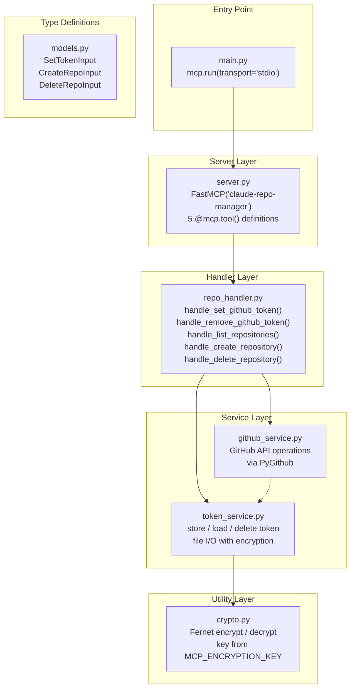
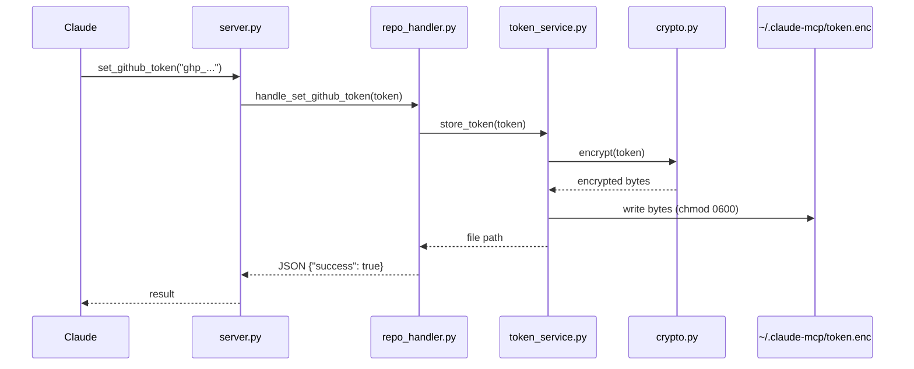
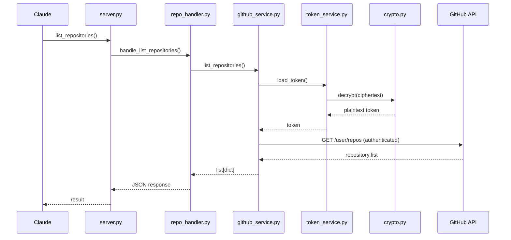
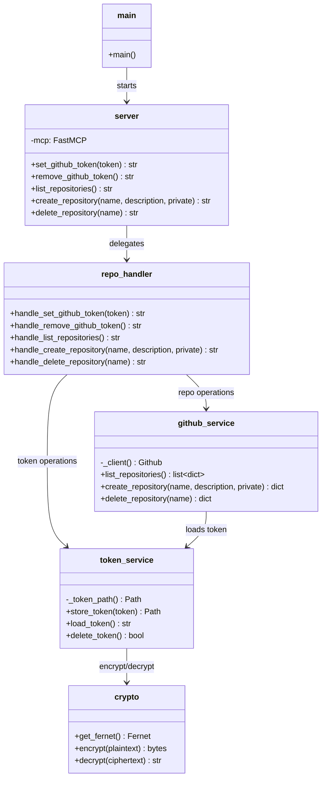
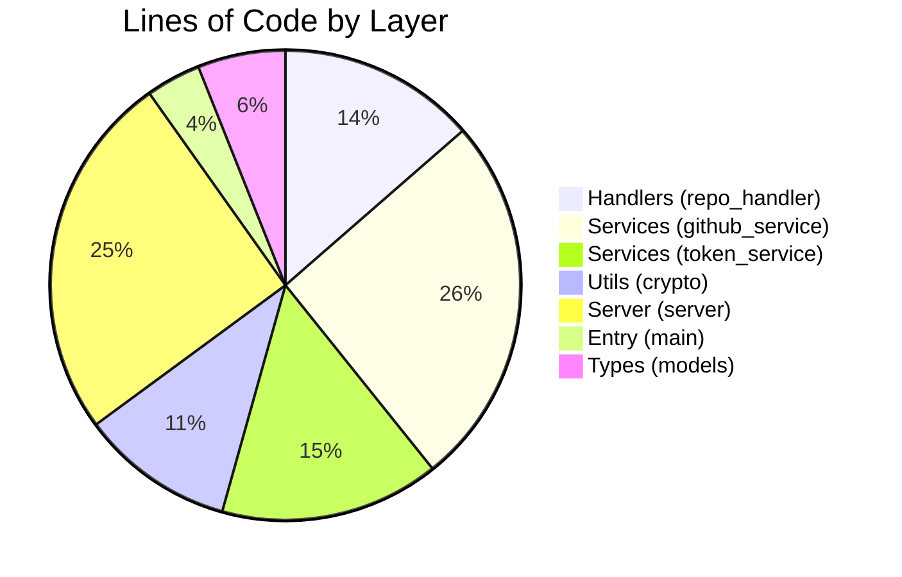

# Architecture

This document describes the internal architecture of claude-mcp-server — how the components fit together, what each module does, and how data flows through the system.

## Overview

claude-mcp-server uses a layered architecture: an MCP server receives tool calls from Claude via stdio transport, delegates them to handler functions, which in turn call service modules for GitHub API operations and token management. Encryption utilities sit at the bottom layer.

## Component Diagram

## Module Responsibilities

| Module | Path | Responsibility |
|--------|------|----------------|
| `main.py` | `src/main.py` | Entry point. Starts the MCP server with stdio transport. |
| `server.py` | `src/server.py` | Defines the FastMCP instance and registers all 5 tools. |
| `repo_handler.py` | `src/handlers/repo_handler.py` | Handles tool calls, orchestrates service calls, formats JSON responses. |
| `github_service.py` | `src/services/github_service.py` | Interacts with the GitHub API via PyGithub. Manages client lifecycle. |
| `token_service.py` | `src/services/token_service.py` | Manages encrypted token storage on disk. Handles file paths and permissions. |
| `crypto.py` | `src/utils/crypto.py` | Provides Fernet-based encrypt/decrypt. Reads the encryption key from environment. |
| `models.py` | `src/types/models.py` | Pydantic models for tool input validation (`SetTokenInput`, `CreateRepoInput`, `DeleteRepoInput`). |

## Data Flow: Token Storage

When a user calls `set_github_token`, the token flows through the layers to be encrypted and stored on disk.

## Data Flow: Repository Operation

When a user calls `list_repositories` (or `create_repository` / `delete_repository`), the token is decrypted from disk, used to authenticate with GitHub, and the result flows back.

## Module Relationships

## Code Distribution

## Dependencies

| Package | Version | Role |
|---------|---------|------|
| `mcp[cli]` | >= 1.2.0 | Model Context Protocol server framework |
| `PyGithub` | >= 2.1.1 | GitHub REST API client |
| `cryptography` | >= 42.0.0 | Fernet encryption for token-at-rest |
| `pydantic` | >= 2.0.0 | Data validation and model definitions |

### Dev Dependencies

| Package | Version | Role |
|---------|---------|------|
| `pytest` | >= 8.0.0 | Test framework |
| `pytest-asyncio` | >= 0.23.0 | Async test support |

## Environment Variables

| Variable | Required | Default | Description |
|----------|----------|---------|-------------|
| `MCP_ENCRYPTION_KEY` | Yes | — | Fernet encryption key for token storage |
| `MCP_TOKEN_PATH` | No | `~/.claude-mcp/token.enc` | Custom path for the encrypted token file |
