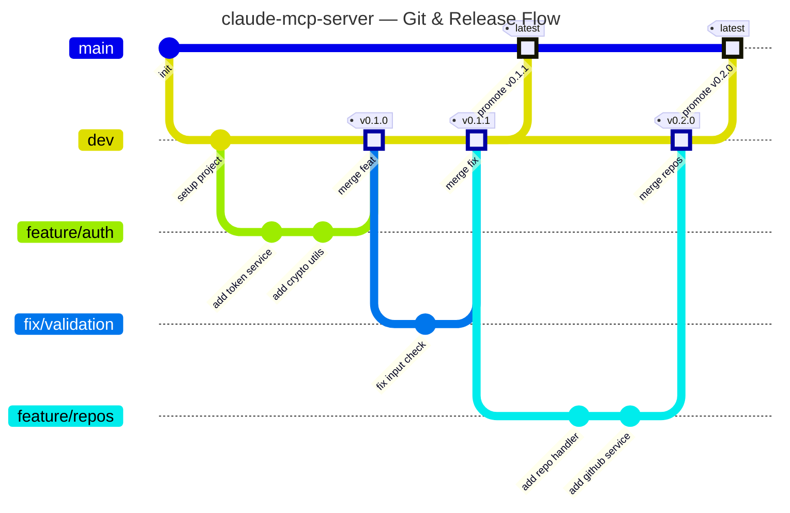
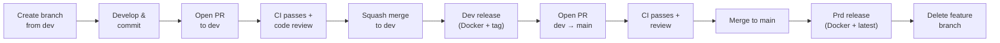
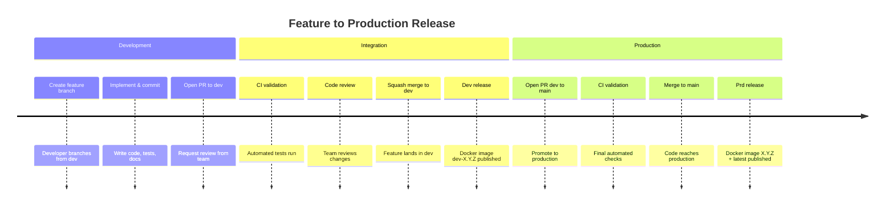

# Branching Strategy

This project follows a modified **GitHub Flow** model with two permanent branches (`main` and `dev`) and short-lived feature branches.

## Branch Types

| Branch | Purpose | Lifetime |
|--------|---------|----------|
| `main` | Production-ready code. Always deployable. Triggers production Docker release. | Permanent |
| `dev` | Integration/staging branch. Version bumps and dev Docker releases happen here. | Permanent |
| `feature/*` | New features | Short-lived |
| `fix/*` | Bug fixes | Short-lived |
| `chore/*` | Maintenance, deps, config | Short-lived |
| `docs/*` | Documentation changes | Short-lived |
| `claude/*` | AI-assisted development branches | Short-lived |

## Git Flow



## Branch Lifecycle

The full lifecycle of a feature branch, from creation to production release:



## Release Timeline

A typical release cycle from feature development to production:



## Rules

1. **Never push directly to `main` or `dev`.** All changes go through Pull Requests.
2. Feature branches are created from `dev` and merged back to `dev` via PR.
3. `dev` is promoted to `main` for production releases via PR.
4. Use **squash merge** for feature branches to keep history clean.
5. Delete branches after merge — keep the repo clean.
6. Rebase feature branches on `dev` before opening a PR to keep history linear.
7. PRs to `dev` **must** have a version label: `feature`, `fix`, `breaking`, or `no-deploy`.

## Quick Reference

```bash
# Start a new feature
git checkout dev && git pull origin dev
git checkout -b feature/my-feature

# Work on the feature
git add <files>
git commit -m "feat(scope): add new feature"

# Push and open PR to dev
git push -u origin feature/my-feature
gh pr create --fill --base dev

# After approval, squash merge via GitHub UI
# Then promote dev to main when ready for production
```
