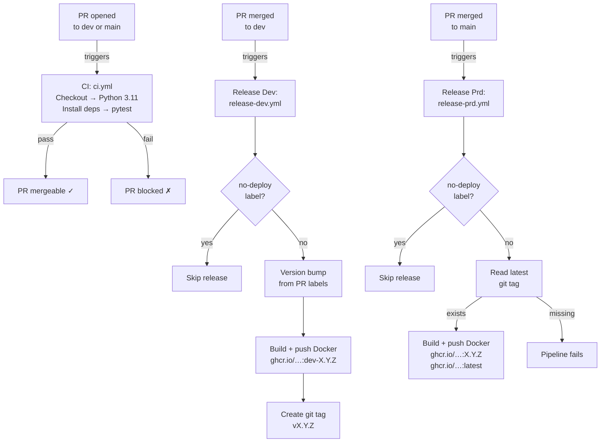
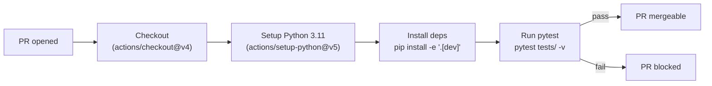
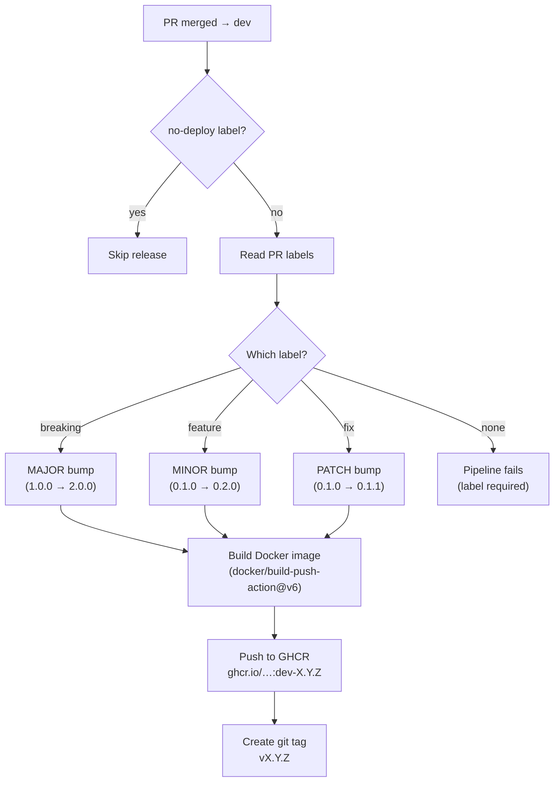
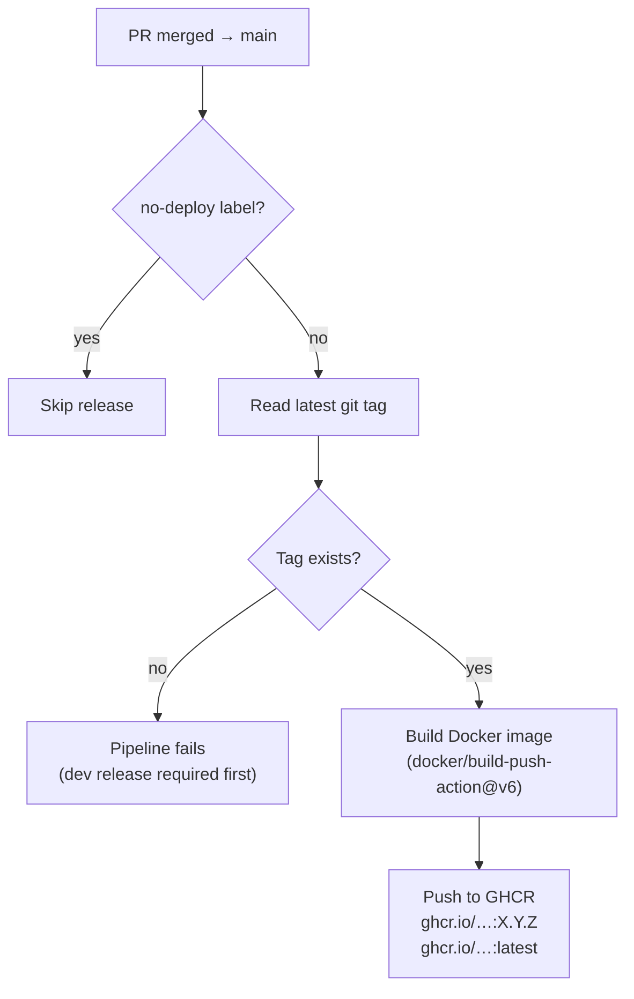
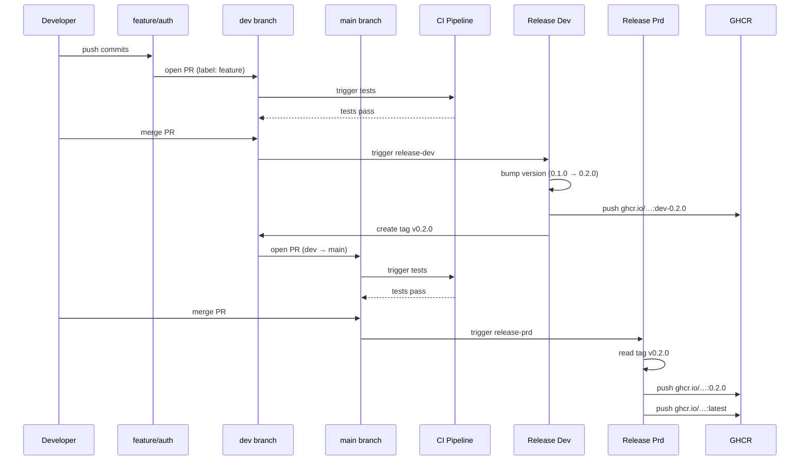

# CI/CD Pipeline

This project uses a three-stage GitHub Actions pipeline: PR validation, dev release, and production release. All workflow configuration lives in `.github/workflows/`.

## Pipeline Overview

## Stage 1: CI — Pull Request Validation

**Workflow:** `ci.yml`
**Trigger:** Every PR targeting `dev` or `main`.

All actions are pinned to commit SHAs for reproducibility and supply-chain security.

## Stage 2: Dev Release

**Workflow:** `release-dev.yml`
**Trigger:** PR merged into `dev` (skipped if `no-deploy` label is present).

**What happens under the hood:**

1. Checkout with full history (`fetch-depth: 0`, `fetch-tags: true`)
2. Read PR labels to determine bump type (major/minor/patch)
3. Find latest `v*` tag and calculate next version
4. Login to GHCR with `GITHUB_TOKEN`
5. Build Docker image with BuildKit layer caching (`type=gha`)
6. Push image tagged `dev-X.Y.Z`
7. Create and push annotated git tag `vX.Y.Z`

**Concurrency:** Uses `concurrency: release-dev` group — only one dev release runs at a time (no cancellation of in-progress runs).

## Stage 3: Production Release

**Workflow:** `release-prd.yml`
**Trigger:** PR merged into `main` (skipped if `no-deploy` label is present).

**Prerequisite:** A dev release must exist (a `v*` tag must be present). The production pipeline reads the latest tag — it does not bump versions itself.

**Concurrency:** Uses `concurrency: release-prd` group.

## End-to-End Example

A complete feature from development to production:

## Pipeline Stage Durations

Approximate timing for each pipeline stage:

```mermaid
gantt
    title CI/CD Pipeline Timing
    dateFormat ss
    axisFormat %S s

    section CI Pipeline
        Checkout code           :ci1, 00, 3s
        Setup Python 3.11       :ci2, after ci1, 5s
        Install dependencies    :ci3, after ci2, 15s
        Run pytest              :ci4, after ci3, 5s

    section Dev Release
        Checkout (full history) :dev1, 00, 5s
        Determine version bump  :dev2, after dev1, 2s
        Login to GHCR           :dev3, after dev2, 2s
        Build Docker image      :dev4, after dev3, 30s
        Push to GHCR            :dev5, after dev4, 10s
        Create git tag          :dev6, after dev5, 3s

    section Prd Release
        Checkout (full history) :prd1, 00, 5s
        Resolve version tag     :prd2, after prd1, 2s
        Login to GHCR           :prd3, after prd2, 2s
        Build Docker image      :prd4, after prd3, 30s
        Push to GHCR (2 tags)   :prd5, after prd4, 10s
```

## Docker Tag Summary

| Event | Docker Tag | Example |
|-------|-----------|---------|
| Merge to `dev` | `dev-<version>` | `ghcr.io/pedrovmota/claude-mcp-server:dev-0.2.0` |
| Merge to `main` | `<version>` | `ghcr.io/pedrovmota/claude-mcp-server:0.2.0` |
| Merge to `main` | `latest` | `ghcr.io/pedrovmota/claude-mcp-server:latest` |

## Version Bump Rules

Applied via **PR labels** on merges to `dev`:

| Label | Bump | Example |
|-------|------|---------|
| `fix` | patch | `0.1.0` → `0.1.1` |
| `feature` | minor | `0.1.0` → `0.2.0` |
| `breaking` | major | `0.1.0` → `1.0.0` |
| `no-deploy` | **skip** | Merge without triggering any release |
| *(none)* | **error** | Pipeline fails — label is required |

## Security Notes

- All GitHub Actions are **pinned to commit SHAs** (not mutable tags) to prevent supply-chain attacks.
- GHCR authentication uses the built-in `GITHUB_TOKEN` — no manual secrets required for Docker pushes.
- Docker layer caching uses GitHub Actions cache (`type=gha`) to speed up builds.
- The runtime Docker image runs as a **non-root user** (`mcp`, UID 1000).
