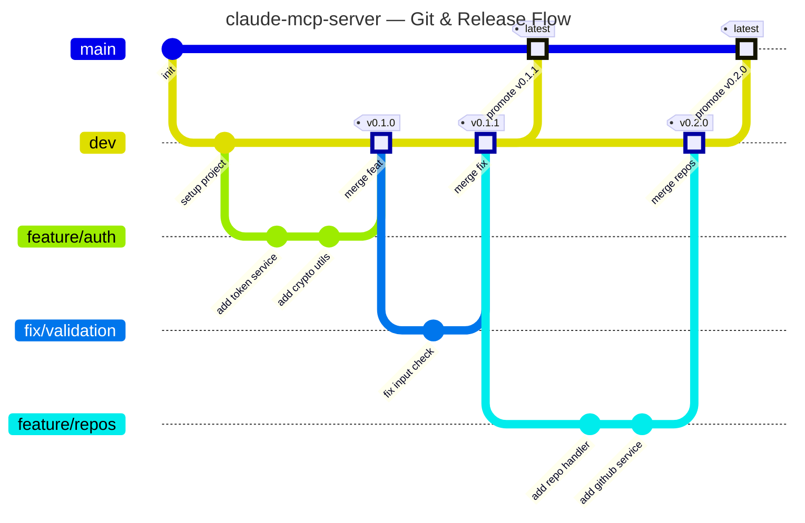
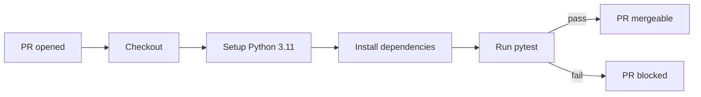
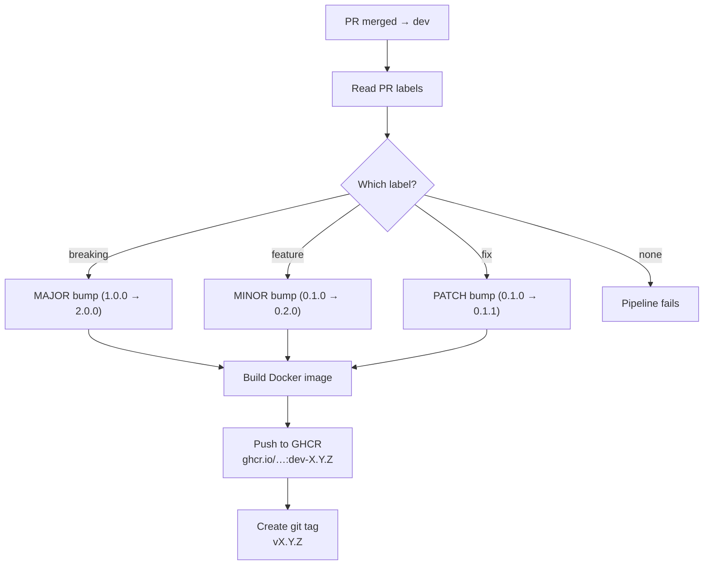
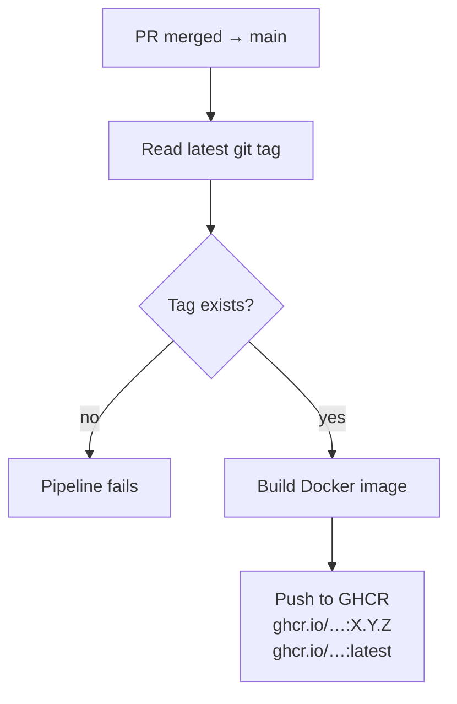
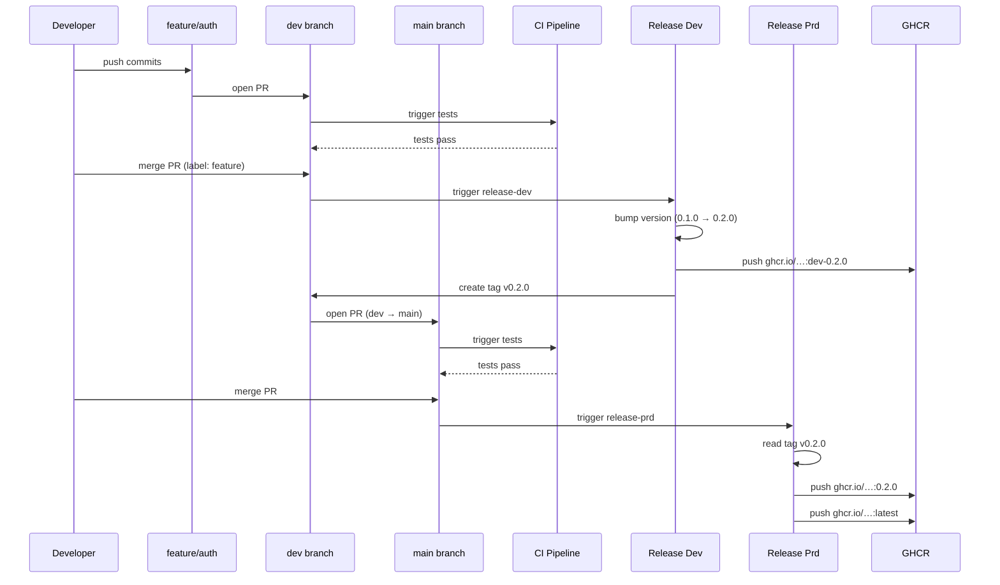

# CI/CD Pipeline

## Git Workflow

## Pipeline Stages

### 1. CI — Pull Request Validation (`ci.yml`)

Runs on every PR targeting **`dev`** or **`main`**.

### 2. Dev Release (`release-dev.yml`)

Triggers when a PR is **merged into `dev`**.

### 3. Production Release (`release-prd.yml`)

Triggers when a PR is **merged into `main`**.

## End-to-End Example

## Docker Tag Summary

| Event | Docker Tag | Example |
|-------|-----------|---------|
| Merge to `dev` | `dev-<version>` | `ghcr.io/pedrovmota/claude-mcp-server:dev-0.2.0` |
| Merge to `main` | `<version>` | `ghcr.io/pedrovmota/claude-mcp-server:0.2.0` |
| Merge to `main` | `latest` | `ghcr.io/pedrovmota/claude-mcp-server:latest` |

## Version Bump Rules

Applied via **PR labels** on merges to `dev`:

| Label | Bump | Example |
|-------|------|---------|
| `fix` | patch | `0.1.0` → `0.1.1` |
| `feature` | minor | `0.1.0` → `0.2.0` |
| `breaking` | major | `0.1.0` → `1.0.0` |
| *(none)* | **error** | Pipeline fails — label is required |
