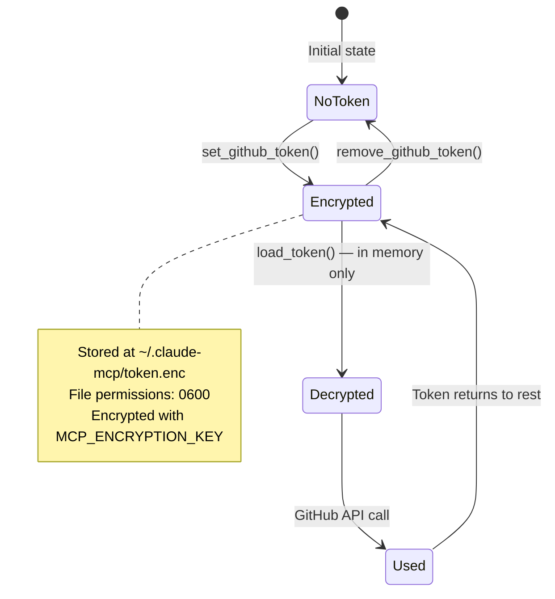

# Security

This document describes the security model for token storage, encryption, and CI/CD in claude-mcp-server.

## Encryption Model

GitHub Personal Access Tokens are encrypted at rest using **Fernet** from the `cryptography` library. Fernet provides:

- **AES-128-CBC** encryption for confidentiality
- **HMAC-SHA256** for authentication (tamper detection)
- **Timestamp-based** tokens (enables optional expiry checks)

The encryption key is provided via the `MCP_ENCRYPTION_KEY` environment variable and is never stored on disk by the application.

## Token Lifecycle



### States

| State | Location | Protection |
|-------|----------|------------|
| **NoToken** | — | No token exists |
| **Encrypted** | `~/.claude-mcp/token.enc` | Fernet encryption + file permissions (0600) |
| **Decrypted** | Process memory | Exists only for the duration of a single API call |
| **Used** | HTTPS connection to GitHub | TLS in transit |

## File Permissions

- The encrypted token file is created with `chmod 0600` (owner read/write only).
- The directory `~/.claude-mcp/` is created with `mkdir -p` (inherits umask).
- Custom token path can be set via `MCP_TOKEN_PATH` environment variable.

## Key Generation

Generate a Fernet encryption key:

```bash
python -c "from cryptography.fernet import Fernet; print(Fernet.generate_key().decode())"
```

Store the key securely — if lost, the encrypted token cannot be recovered. Generate a new key and re-store the token.

## Environment Variables

| Variable | Required | Description |
|----------|----------|-------------|
| `MCP_ENCRYPTION_KEY` | Yes | Fernet encryption key. Must be a valid 32-byte URL-safe base64-encoded key. |
| `MCP_TOKEN_PATH` | No | Override the default token file path (`~/.claude-mcp/token.enc`). |

## User Journey: Token Setup

The experience of setting up and using token security:


## Threat Model

### What is protected

- **Token at rest** — the GitHub PAT is encrypted on disk. An attacker who reads the file cannot extract the token without the encryption key.
- **File access** — restrictive permissions (0600) prevent other users on the same system from reading the token file.

### What is NOT protected

- **Token in memory** — during a GitHub API call, the decrypted token exists briefly in process memory. This is standard for any application that uses credentials.
- **Key management** — the `MCP_ENCRYPTION_KEY` is provided via environment variable. Securing the key (e.g., using a secrets manager, restricting `.env` file access) is the user's responsibility.
- **Network interception** — the token is sent to GitHub over HTTPS. TLS provides transport-layer security, but this is GitHub's responsibility, not this application's.
- **Compromised environment** — if an attacker has the encryption key and access to the token file, they can decrypt the token.

### Assumptions

- The host operating system enforces file permissions correctly.
- The `MCP_ENCRYPTION_KEY` is not committed to version control or logged.
- The user's GitHub PAT has the minimum required scopes (`repo`, `delete_repo`).

## CI/CD Security

- **Pinned action versions** — all GitHub Actions are pinned to commit SHAs (e.g., `actions/checkout@34e114876b...`) rather than mutable tags, preventing supply-chain attacks.
- **GHCR authentication** — uses the built-in `GITHUB_TOKEN` secret. No manual secrets need to be configured for Docker image pushes.
- **No secrets in code** — `.env` files are gitignored, and no credentials exist in source.
- **Non-root Docker user** — the runtime container runs as user `mcp` (UID 1000), not root.
- **Minimal Docker image** — uses `python:3.11-slim` with multi-stage build to reduce attack surface.
